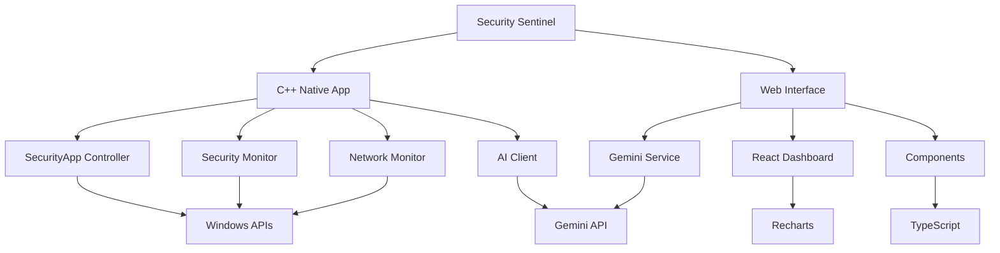

# Security Sentinel for Windows 11

[](https://opensource.org/licenses/MIT)
[](https://www.microsoft.com/windows/)
[](https://en.cppreference.com/w/cpp/17)
[](https://reactjs.org/)
[](https://ai.google.dev/)

> **A comprehensive security monitoring application for Windows 11 with AI-powered threat analysis using Google's Gemini API.**


## 🌟 Key Features

| Feature | C++ Native | Web Interface |
|---------|------------|---------------|
| **🛡️ Real-time Security Monitoring** | ✅ Full Windows API integration | ✅ Dashboard visualization |
| **🤖 AI-Powered Analysis** | ✅ Gemini streaming support | ✅ Interactive chat interface |
| **🌐 Network Traffic Monitoring** | ✅ Deep packet inspection | ✅ Connection visualization |
| **⚡ Threat Protection** | ✅ Automatic IP blocking | ✅ Threat timeline |
| **📊 Interactive Dashboard** | ✅ Console interface | ✅ Modern web UI |
| **🔍 Process Monitoring** | ✅ Administrator access | ⚠️ Limited browser access |
| **🚀 Performance** | ✅ Native performance | ✅ Responsive interface |

## 🚀 Quick Start

### Choose Your Version

<table>
<tr>
<td width="50%">

#### 🔥 **C++ Edition** (Recommended)
**Professional-grade native monitoring**

- ✅ **Full Windows API access**
- ✅ **Real-time threat blocking**
- ✅ **Administrator-level monitoring**
- ✅ **High performance & low overhead**
- ✅ **Advanced threat detection**

**[📖 C++ Documentation](README_CPP.md)**

</td>
<td width="50%">

#### 🌐 **Web Edition**
**Modern dashboard experience**

- ✅ **Beautiful React interface**
- ✅ **Cross-platform compatibility**
- ✅ **Interactive visualizations**
- ✅ **AI chat assistant**
- ✅ **Easy to deploy**

**[🌍 Try Web Demo](#web-interface-setup)**

</td>
</tr>
</table>

### ⚡ 5-Minute Setup

1. **Get Gemini API Key** → [Google AI Studio](https://makersuite.google.com/app/apikey)
2. **Download Release** → [GitHub Releases](https://github.com/GizzZmo/security-sentinel-for-windows-11/releases)
3. **Configure** → Add API key to `config.ini`
4. **Run as Admin** → Launch `SecuritySentinel.exe`

**[📚 Complete Installation Guide →](wiki/Installation-Guide.md)**

## 📖 Documentation Hub

### 🏠 **Getting Started**
| Guide | Description |
|-------|-------------|
| **[🚀 Quick Start](wiki/Quick-Start.md)** | Get running in 5 minutes |
| **[💾 Installation Guide](wiki/Installation-Guide.md)** | Complete setup instructions |
| **[⚙️ Configuration](wiki/Configuration.md)** | Customize your setup |
| **[📋 System Requirements](wiki/System-Requirements.md)** | Hardware & software needs |

### 🔧 **User Guides**
| Guide | Description |
|-------|-------------|
| **[📊 Dashboard Overview](wiki/Dashboard-Overview.md)** | Understanding the interface |
| **[🌐 Network Monitoring](wiki/Network-Monitoring.md)** | Monitor traffic & connections |
| **[🛡️ Threat Protection](wiki/Threat-Protection.md)** | Security features & response |
| **[🤖 AI Assistant](wiki/AI-Assistant.md)** | Leverage AI for security |

### 👩‍💻 **Developer Resources**
| Resource | Description |
|----------|-------------|
| **[🏗️ Architecture Overview](wiki/Architecture-Overview.md)** | System design & components |
| **[📡 API Reference](wiki/API-Reference.md)** | Complete API documentation |
| **[🔨 Development Setup](wiki/Development-Setup.md)** | Build environment setup |
| **[🤝 Contributing Guidelines](wiki/Contributing-Guidelines.md)** | How to contribute |

### 🆘 **Support & Troubleshooting**
| Resource | Description |
|----------|-------------|
| **[❓ Common Issues](wiki/Common-Issues.md)** | Quick problem solving |
| **[🔍 Debugging Guide](wiki/Debugging-Guide.md)** | Troubleshooting techniques |
| **[⚡ Performance Optimization](wiki/Performance-Optimization.md)** | Improve efficiency |
| **[📞 Support](wiki/Support.md)** | Getting help |

**[📚 Complete WIKI Documentation →](wiki/Home.md)**

## 🔥 C++ Native Application

### Installation

#### Method 1: Pre-built Release (Recommended)
```bash
# Download from GitHub releases
https://github.com/GizzZmo/security-sentinel-for-windows-11/releases

# Extract and configure
cd SecuritySentinel
echo api_key=YOUR_GEMINI_API_KEY_HERE > config.ini

# Run as Administrator
SecuritySentinel.exe
```

#### Method 2: Build from Source
```bash
# Prerequisites: Visual Studio 2019/2022, CMake 3.16+
git clone https://github.com/GizzZmo/security-sentinel-for-windows-11.git
cd security-sentinel-for-windows-11

# Build
mkdir build && cd build
cmake ..
cmake --build . --config Release

# Configure and run
echo [gemini] > config.ini
echo api_key=YOUR_API_KEY_HERE >> config.ini
Release\SecuritySentinel.exe
```

### Sample Console Output
```
==================================================
        SECURITY SENTINEL FOR WINDOWS 11
==================================================

SYSTEM OVERVIEW:
├─ CPU Usage: 15.2% ████████░░░░░░░░ 
├─ Memory: 42.7% ██████████████░░░░
├─ Connections: 23 active
└─ Threat Level: LOW (1/5) 🟢

RECENT ACTIVITY:
✅ System scan completed - No threats detected
🌐 Network monitor active - 23 connections tracked  
🤖 AI assistant ready - Gemini 2.5 Flash connected
🛡️ Threat protection enabled - 2 IPs blocked

MENU: [1] Dashboard [2] Network [3] Threats [4] AI [0] Exit
Select option: _
```

## 🌐 Web Interface Setup

### Prerequisites
- **Node.js 18+** - [Download here](https://nodejs.org/)

### Quick Start
```bash
# Clone and setup
git clone https://github.com/GizzZmo/security-sentinel-for-windows-11.git
cd security-sentinel-for-windows-11

# Install dependencies
npm install

# Configure environment
echo GEMINI_API_KEY=your_api_key_here > .env.local

# Start development server  
npm run dev

# Open browser to http://localhost:5173
```

### Build for Production
```bash
npm run build    # Creates optimized build in dist/
npm run preview  # Preview production build
```

## 🏗️ Architecture Overview



### Core Components

#### **SecurityApp** (C++ Controller)
- Application lifecycle management
- Component coordination
- Configuration handling
- Event processing

#### **GeminiClient** (AI Integration)  
- HTTP client with WinINet
- Streaming response support
- Error handling & retries
- JSON request/response processing

#### **SecurityMonitor** (System Monitoring)
- Real-time process monitoring
- Resource usage tracking
- Event correlation
- Threat level assessment

#### **NetworkMonitor** (Network Security)
- TCP/UDP connection tracking
- Traffic pattern analysis
- Threat detection algorithms
- Automatic IP blocking

**[🏗️ Detailed Architecture Documentation →](wiki/Architecture-Overview.md)**

## 🤖 AI-Powered Security Features

### Intelligent Security Assistant

The integrated Gemini AI provides expert security guidance:

```
You: "What does this network activity indicate?"

AI Assistant: Based on the network connections you're showing, I can see:

1. **Normal Web Traffic**: Chrome connections to Google services (443/HTTPS)
2. **Email Sync**: Outlook connecting to Exchange servers (993/IMAPS)  
3. **Potential Concern**: Unknown process connecting to 192.168.1.200:8080

I recommend investigating that last connection. Here's how:
- Check what process is making the connection
- Verify if 192.168.1.200 is a trusted device on your network
- Consider temporarily blocking the IP if it's suspicious

Would you like me to help you analyze any specific connections?
```

### Security Analysis Capabilities

- **🔍 Threat Intelligence**: Real-time analysis of security events
- **📊 Risk Assessment**: Evaluate system security posture  
- **🎯 Incident Response**: Guidance for security incidents
- **📚 Best Practices**: Personalized security recommendations
- **🔧 Configuration Help**: Optimal security settings advice

**[🤖 AI Assistant Guide →](wiki/AI-Assistant.md)**

## 🛡️ Security Features Deep Dive

### Real-Time Monitoring
| Component | Capabilities |
|-----------|-------------|
| **Process Monitor** | Track new processes, detect suspicious executables, monitor resource usage |
| **Network Monitor** | TCP/UDP connections, traffic analysis, connection state tracking |
| **Resource Monitor** | CPU/Memory usage, disk activity, performance metrics |
| **Event Monitor** | Security event correlation, pattern detection, alert generation |

### Threat Detection & Response
| Feature | Description |
|---------|-------------|
| **Port Scan Detection** | Identify reconnaissance attempts, automatic blocking |
| **DDoS Protection** | Traffic pattern analysis, connection rate limiting |
| **Behavioral Analysis** | Anomaly detection, baseline establishment |
| **IP Blocking** | Automatic threat response, whitelist management |

### Windows API Integration
| API Category | Usage |
|--------------|-------|
| **Process Management** | `EnumProcesses`, `OpenProcess`, `GetModuleBaseName` |
| **Network APIs** | `GetTcpTable`, `GetUdpTable`, `GetNetworkParams` |
| **System Metrics** | `GlobalMemoryStatusEx`, `GetSystemTimes` |
| **Security Context** | `CheckTokenMembership`, privilege detection |

**[🛡️ Complete Security Features →](wiki/Threat-Protection.md)**

## 📊 Performance & Specifications

### System Impact
| Metric | C++ Native | Web Interface |
|--------|------------|---------------|
| **Memory Usage** | ~15-30 MB | ~50-100 MB |
| **CPU Impact** | <1% idle, ~2-5% active | <1% idle, ~3-7% active |
| **Disk Usage** | ~50 MB | ~200 MB with dependencies |
| **Network** | Minimal (AI only) | Minimal (AI only) |

### Monitoring Capabilities
| Feature | Rate | Accuracy |
|---------|------|----------|
| **Process Updates** | 1-10 seconds | 99.9% |
| **Network Scanning** | 1-5 seconds | 99.5% |
| **Threat Detection** | Real-time | 95%+ |
| **AI Response** | 2-10 seconds | Context-dependent |

### Scalability
- **Connections**: Monitor 1000+ simultaneous connections
- **Processes**: Track 500+ processes efficiently  
- **Events**: Store 10,000+ security events
- **History**: Maintain weeks of monitoring data

## 🔧 Configuration & Customization

### Configuration File Structure
```ini
[gemini]
api_key=YOUR_API_KEY_HERE
model=gemini-2.5-flash
max_tokens=1000
temperature=0.7

[monitoring]
enabled=true
update_interval=5
log_level=INFO
max_events=10000

[network]
monitor_enabled=true
block_suspicious=true
whitelist_ips=192.168.1.0/24,10.0.0.0/8
scan_detection_threshold=5
ddos_detection_threshold=100

[ui]
color_scheme=dark
refresh_rate=1000
show_advanced=false
```

### Environment Variables
```bash
# Alternative API key configuration
set GEMINI_API_KEY=your_api_key_here

# Enable debug logging
set SECURITY_SENTINEL_DEBUG=1

# Custom configuration file location
set SECURITY_SENTINEL_CONFIG=C:\custom\path\config.ini
```

**[⚙️ Complete Configuration Guide →](wiki/Configuration.md)**

## 🤝 Contributing

We welcome contributions from the security community! Here's how you can help:

### Ways to Contribute
- 🐛 **Bug Reports**: Found an issue? [Report it here](https://github.com/GizzZmo/security-sentinel-for-windows-11/issues)
- 💡 **Feature Requests**: Have ideas? [Share them here](https://github.com/GizzZmo/security-sentinel-for-windows-11/issues)
- 📝 **Documentation**: Improve our guides and tutorials
- 🔧 **Code**: Submit pull requests for bug fixes and features
- 🧪 **Testing**: Help test new features and report results
- 🎨 **UI/UX**: Improve the user interface and experience

### Development Setup
```bash
# Clone repository
git clone https://github.com/GizzZmo/security-sentinel-for-windows-11.git
cd security-sentinel-for-windows-11

# C++ Development
mkdir build && cd build
cmake .. -G "Visual Studio 17 2022"
cmake --build . --config Debug

# Web Development  
npm install
npm run dev
```

**[🤝 Contributing Guidelines →](wiki/Contributing-Guidelines.md)**

## 📋 Roadmap & Future Features

### Version 2.0 (Planned)
- 🔌 **Plugin System**: Extensible architecture for custom monitoring modules
- 🏢 **Enterprise Features**: Centralized monitoring and reporting
- 📱 **Mobile App**: Companion mobile application for alerts
- 🗄️ **Database Integration**: Persistent storage for long-term analysis

### Research & Development
- 🧠 **Machine Learning**: Advanced anomaly detection algorithms
- 🌍 **Cross-Platform**: Support for Linux and macOS
- 🔐 **Zero-Day Detection**: Advanced techniques for unknown threats
- ☁️ **Cloud Integration**: Cloud-based threat intelligence

**[🗺️ Complete Roadmap →](wiki/Roadmap.md)**

## 🆘 Support & Community

### Getting Help
| Resource | Description | Link |
|----------|-------------|------|
| **📚 Documentation** | Comprehensive guides and tutorials | [WIKI](wiki/Home.md) |
| **❓ Common Issues** | Quick solutions to frequent problems | [Troubleshooting](wiki/Common-Issues.md) |
| **💬 Discussions** | Community Q&A and discussions | [GitHub Discussions](https://github.com/GizzZmo/security-sentinel-for-windows-11/discussions) |
| **🐛 Bug Reports** | Report issues and track fixes | [GitHub Issues](https://github.com/GizzZmo/security-sentinel-for-windows-11/issues) |

### Community Guidelines
- Be respectful and constructive
- Search existing issues before creating new ones
- Provide detailed information when reporting problems
- Follow responsible disclosure for security issues

## 📄 License & Legal

### Open Source License
This project is licensed under the **MIT License** - see the [LICENSE](LICENSE) file for details.

### Legal Usage Notice
⚠️ **Important**: This software is designed for **legitimate security monitoring purposes only**. Users are responsible for:

- ✅ Monitoring only systems they own or have explicit permission to monitor
- ✅ Complying with all applicable laws and regulations
- ✅ Respecting privacy rights and data protection laws
- ✅ Using the software ethically and responsibly

### Disclaimer
The developers are not responsible for misuse of this software. Please use responsibly and in accordance with applicable laws.

**[📋 Complete About Page →](ABOUT.md)**

---

<div align="center">

### 🌟 **Security Sentinel for Windows 11** 

**Empowering users with intelligent, real-time security monitoring**

[📖 Documentation](wiki/Home.md) • [🚀 Quick Start](wiki/Quick-Start.md) • [💾 Download](https://github.com/GizzZmo/security-sentinel-for-windows-11/releases) • [🤝 Contribute](wiki/Contributing-Guidelines.md)

**Made with ❤️ by the security community**

</div>
